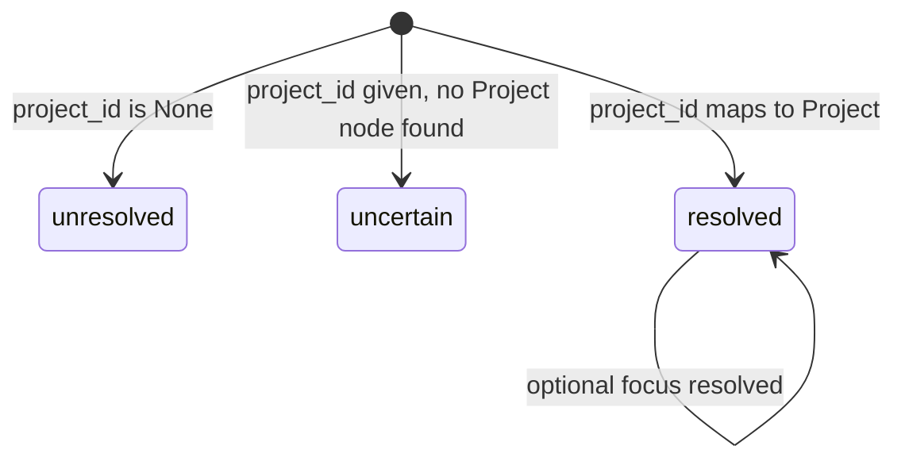
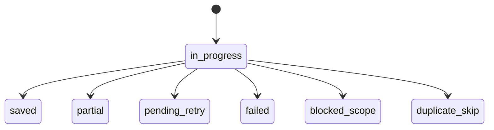

# Engine Specifications

The business logic layer is split into focused, stateless engines. Each engine receives all required inputs as parameters and returns structured result models without keeping in-process session state.

---

## ScopeEngine

**Purpose:** Resolve whether a `project_id` and optional `focus` refer to an addressable memory scope before reads and writes run.

- `unresolved` blocks writes and returns empty reads
- `uncertain` allows discovery-style reads but still blocks writes
- `resolved` permits normal reads and writes

---

## RetrievalEngine

**Purpose:** Load scoped memory bundles with retry, freshness, conflict, and hygiene metadata.

- Merge order is **focus → project → global**
- Default limits are:
  - focus: `10`
  - project: `20`
  - global: `5`
- Retrieval supports timeout + retry (`GRAPHBASE_RETRIEVAL_TIMEOUT_S`, `GRAPHBASE_RETRIEVAL_MAX_RETRIES`)
- Results surface `conflicts_found`, `hygiene_due`, `truncated_scopes`, and `next_step`

`RetrievalStatus` values:

| Status | Meaning |
|---|---|
| `succeeded` | Results returned |
| `empty` | No matching memory found |
| `timed_out` | Query exceeded timeout and retry handling took over |
| `failed` | Neo4j or query execution error |
| `conflicted` | Result set contains conflicting memory while still returning data |

---

## SurfaceEngine

**Purpose:** Provide fast BM25 keyword lookup without a full scope-aware context bundle.

- Backing indexes: `decision_fulltext`, `pattern_fulltext`, `context_fulltext`, `entity_fulltext`
- Hybrid search behavior is controlled by `GRAPHBASE_FTS_ENABLED`, `GRAPHBASE_FTS_LIMIT`, and `GRAPHBASE_RRF_K`
- Used by the `memory_surface` tool and the `graphbase surface` CLI

This engine is optimized for “quick topic scan” workflows, especially before editing or delegating work.

---

## WriteEngine And Dedup

**Purpose:** Persist sessions, decisions, patterns, context, and entity facts while enforcing governance and deduplication rules.

Key behaviors:

- Global writes require `request_global_write_approval`
- Decision dedup uses:
  - exact SHA-256 hash lookup
  - candidate search + Jaccard similarity
- Pattern dedup uses exact hash lookup only
- Transient write failures return `pending_retry` instead of crashing the caller

---

## HygieneEngine

**Purpose:** Report memory quality issues without mutating graph state automatically.

Checks performed in the full scan path:

1. Duplicate decisions
2. Outdated decisions
3. Obsolete patterns
4. Entity drift
5. Unresolved saves

Important runtime behavior:

- `check_pending_only=True` skips content scans and returns pending-save status only
- `last_hygiene_at` is updated only after a successful full report
- Expired or used governance tokens are cleaned up during the full hygiene cycle

The engine returns `HygieneReport`, including `candidate_ids`, `unresolved_saves`, and optional pending-save detail fields.

---

## FederationEngine

**Purpose:** Manage workspace membership, liveness, and cross-service search.

Responsibilities:

- register/deregister federated services
- list active services in a workspace
- search memory across services
- create typed cross-service links between entity facts

This engine is the bridge between per-project memory and multi-service workspace coordination.

---

## ImpactEngine

**Purpose:** Assess downstream risk of changes across cross-service links and summarize workspace health.

Responsibilities:

- BFS impact propagation from a source entity
- risk scoring by depth and contradiction edges
- workspace health summaries
- inline conflict reporting

This engine powers both `propagate_impact` and `graph_health`.

---

## TopologyWriteEngine

**Purpose:** Maintain the service topology graph: services, shared infrastructure, feature flows, and dependency traversal.

Responsibilities:

- register dual-label `:Project:Service` nodes
- validate and write typed topology edges
- batch upsert shared infrastructure
- traverse service dependencies
- return ordered feature workflows

Topology operations are separate from memory artifact writes but share the same Neo4j store and workspace model.
