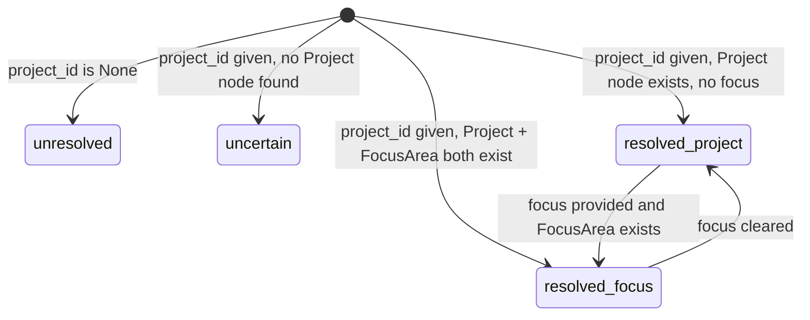
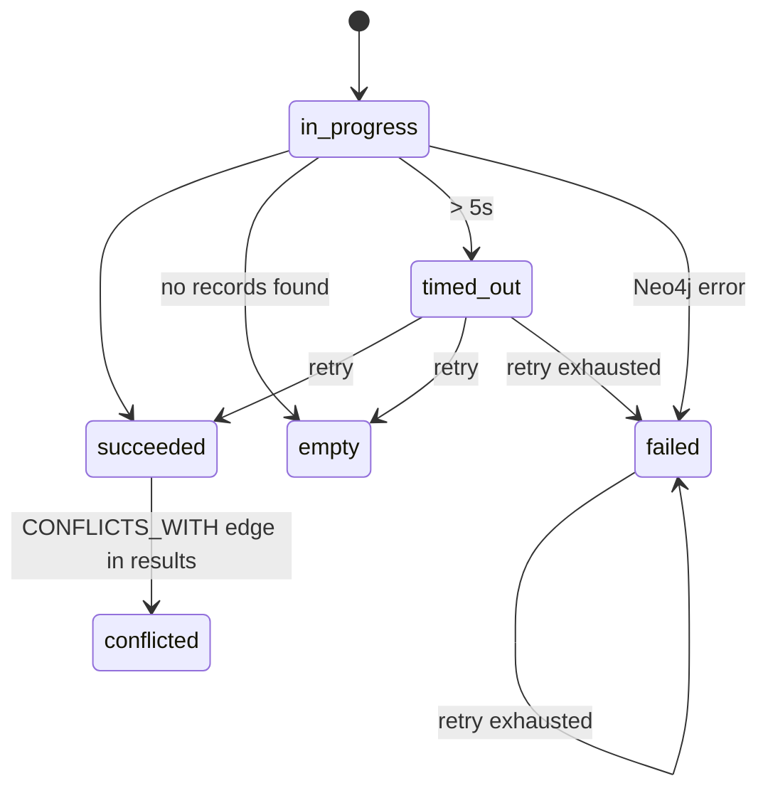
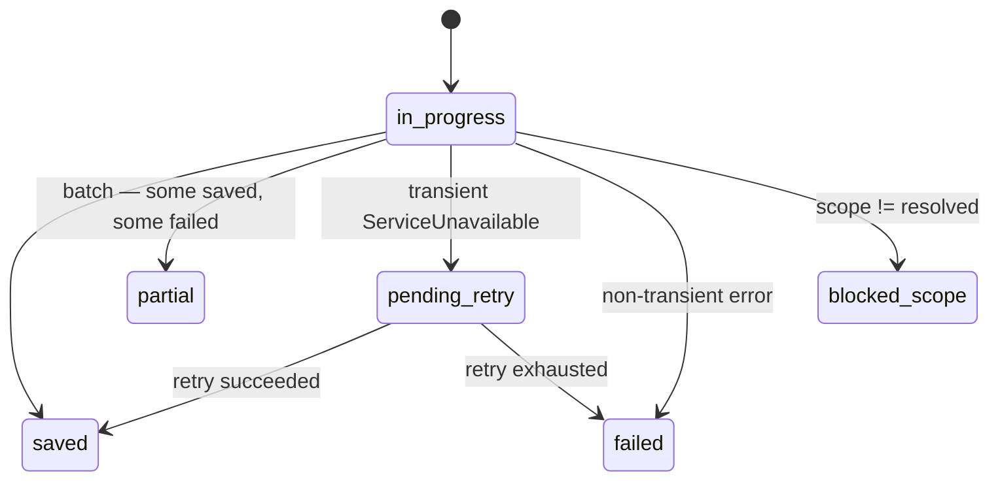

# Engine Specifications

The business logic layer contains five specialized engines. Each engine is stateless — it receives all required inputs as parameters and produces a result without storing state between calls.

---

## ScopeEngine

**Purpose:** Validate scope resolution before every MCP read or write.

**Input:** `project_id: str | None`, `focus: str | None`



**Write gate:** Only `resolved` states permit writes. All others return `blocked_scope`.

**Read gate:** `unresolved` → empty result. `uncertain` → allows project-scope reads only.

---

## RetrievalEngine

**Purpose:** Query Neo4j across scopes with priority merge, timeout, and retry.



**Priority merge** — results from three scope levels are concatenated in order:

1. `focus` scope — up to 10 items (if focus is set)
2. `project` scope — up to 10 items
3. `global` scope — up to 5 items

**Supersession filter** — nodes connected by an incoming `[:SUPERSEDES]` edge from a newer node are excluded from results automatically.

**`hygiene_due` flag** — if `Project.last_hygiene_at` is `NULL` or older than 30 days, the engine sets `hygiene_due=true` in the returned `ContextBundle`.

---

## DedupEngine

**Purpose:** Prevent duplicate decisions and patterns from accumulating in the graph.

**Input:** `title: str`, `rationale: str`, `scope`, `project_id`

**Step 1 — Exact hash match (O(1)):**

```
content_hash = SHA-256(normalize(title + rationale))
if hash found in graph → DedupOutcome.duplicate_skip  (no write)
```

**Step 2 — Full-text + Jaccard (top-5 candidates):**

```
CALL db.index.fulltext.queryNodes("decision_fulltext", title + " " + rationale)
For each candidate: Jaccard(title_tokens, candidate.title_tokens)

best_score ≥ 0.70 → DedupOutcome.supersede      (write + [:SUPERSEDES] → old)
best_score ≥ 0.50 → DedupOutcome.manual_review   (write blocked, candidate id returned)
best_score <  0.50 → DedupOutcome.new             (write proceeds)
```

Pattern dedup uses Step 1 only — patterns are structured enough that exact hash match is sufficient.

!!! note "Transaction boundary"
    DedupEngine runs **inside** the write transaction function. This ensures the hash check and
    the write are atomic — no TOCTOU race condition when multiple agents write concurrently.

---

## WriteEngine

**Purpose:** Orchestrate governance gate → dedup → write → retry for all memory writes.



**Business output guarantee (FR-48):** The tool handler returns the business result to the caller
_before_ the write is confirmed. Write status is a field in the response, not an exception.

**Governance gate:** If `scope == global`, the engine validates the `governance_token` via
`token_repo` before attempting the write. Invalid or expired tokens return `status: "failed"`.

---

## AnalysisRouter

**Purpose:** Route a task description to the appropriate reasoning mode.

**Routing logic:**

| Keywords | Mode |
|---|---|
| `strategic`, `multi-factor`, `planning` | `sequential` |
| `trade-off`, `compare`, `debate` | `debate` |
| `unclear`, `requirements`, `discovery` | `socratic` |
| (none / unknown) | `sequential` (safe default) |

Returns `AnalysisResult` with `mode`, `rationale`, and `suggested_steps`.

---

## HygieneEngine

**Purpose:** Detect memory quality problems across a project or global scope.

**Trigger:** Manual via `run_hygiene` tool or `graphbase hygiene` CLI.

**Five checks run in sequence:**

1. **Duplicate detection** — full-text similarity scan for pairs with score > 0.9
2. **Outdated decisions** — `date < now - 180d` AND no outgoing `[:SUPERSEDES]` edge
3. **Obsolete patterns** — `last_validated_at < now - 90d`
4. **EntityFact normalization** — same `entity_name` across multiple nodes → propose `[:MERGES_INTO]`
5. **Unresolved saves** — nodes with `status IN [pending_retry, failed]`

**Read-only contract:** HygieneEngine never auto-mutates. It returns a `HygieneReport` with
`candidate_ids` per category. All mutations require explicit caller confirmation.

`Project.last_hygiene_at` is updated only after a successful report is generated.
