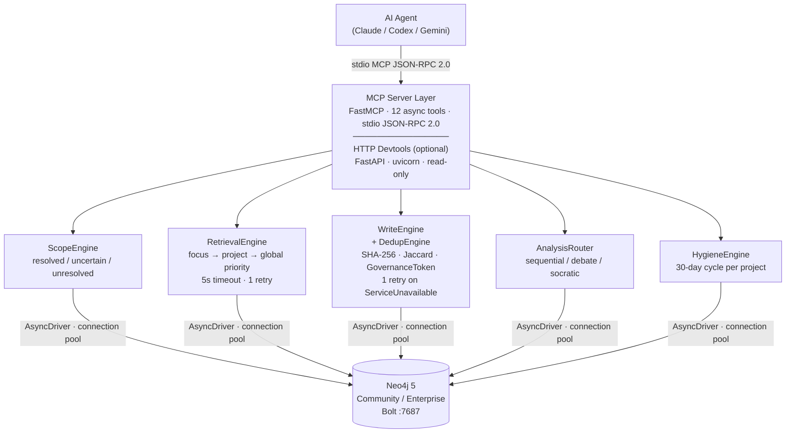

# System Overview

`graphbase` is a three-layer system: an MCP server layer that handles protocol
and tool dispatch, a business logic layer with specialized engines, and a graph layer backed by Neo4j.

---

## Component diagram



---

## Request lifecycle

Every MCP tool call follows the same path:

```
Agent → FastMCP (deserialize + validate Pydantic schema)
      → ScopeEngine (validate project_id / focus)
      → RetrievalEngine OR WriteEngine (depending on tool)
      → Neo4j AsyncDriver (Bolt)
      → Result serialized to JSON → Agent
```

Tools always return a structured response — errors are encoded as status fields, never as exceptions
thrown to the caller (see FR-48: business output before write status).

---

## Transport

The server uses **MCP stdio transport** — it reads JSON-RPC 2.0 requests from stdin and writes
responses to stdout. No network port is opened for agent use. The optional HTTP devtools server
(FastAPI + uvicorn) is a separate process started with `graphbase devtools`.

---

## Package layout

```
src/graphbase_memories/
├── main.py               CLI entry (typer): serve | devtools | hygiene
├── config.py             pydantic-settings: all GRAPHBASE_* env vars
├── mcp/
│   ├── server.py         FastMCP app instance + tool registration
│   ├── tools/            12 tool handlers (one file per group)
│   └── schemas/          Pydantic I/O models (artifacts, results, enums)
├── engines/              Business logic (scope, retrieval, write, dedup, analysis, hygiene)
├── graph/
│   ├── driver.py         AsyncGraphDatabase singleton + lifespan context manager
│   ├── models.py         Node/relationship Python dataclasses
│   ├── queries/          Cypher files (schema.cypher, retrieval, write, dedup, hygiene)
│   └── repositories/     One repo per node type (session, decision, pattern, context, entity, hygiene, token)
└── devtools/             FastAPI HTTP inspection server
```

---

## Key design decisions

| Decision | Choice | Rationale |
|---|---|---|
| Dedup strategy | SHA-256 exact + full-text + Jaccard | No embeddings needed for MVP; deterministic and explainable |
| Scope statefulness | Stateless — `project_id` on every call | No in-process session state; safe for multi-agent use |
| GovernanceToken storage | Neo4j node (not in-memory) | Durable across server restarts |
| Error handling | Business output before write status | Agent never crashes; always gets a usable response |
| Async throughout | `AsyncDriver` + `async def` everywhere | Matches FastMCP's async execution model |
