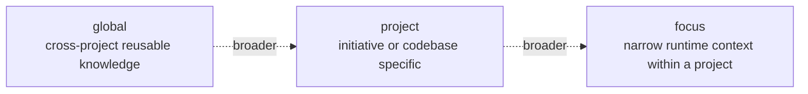
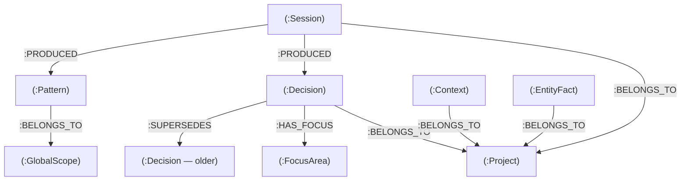

# Memory Model

`graphbase` organizes memory as a **property graph** in Neo4j. Understanding the model helps agents write better queries and avoid common mistakes like scope confusion or unintended overwrites.

---

## Scopes

Memory is partitioned into three scopes:



| Scope | Purpose | Example |
|---|---|---|
| `global` | Patterns and decisions reusable across all projects | "Always call retrieve_context before reasoning to load session context" |
| `project` | Knowledge specific to one initiative or codebase | "graphbase-memories uses Jaccard threshold 0.70 for supersede" |
| `focus` | Narrow runtime context within a project | "Current session is refactoring the dedup engine" |

**Retrieval priority:** `focus` > `project` > `global` — narrower context wins.

A global pattern does **not** automatically override a project-specific decision. The agent sees all three and reasons from the most specific context first.

---

## Artifact types

Five node labels represent different categories of memory:

| Label | What it stores | Dedup strategy |
|---|---|---|
| `Session` | Session summaries (objective, actions, decisions, next steps) | No dedup — every session is unique |
| `Decision` | Architectural or technical decisions | SHA-256 exact + Jaccard similarity (2-step) |
| `Pattern` | Repeatable workflows (trigger + steps + exclusions) | SHA-256 exact only |
| `Context` | Free-form snippets with relevance score | No dedup |
| `EntityFact` | Named entity facts | MERGE on `entity_name` (upsert) |

---

## Graph edges

| Relationship | From → To | Meaning |
|---|---|---|
| `[:BELONGS_TO]` | Any artifact → `Project` or `GlobalScope` | Scope assignment |
| `[:HAS_FOCUS]` | Any artifact → `FocusArea` | Narrow focus within project |
| `[:SUPERSEDES]` | `Decision` → older `Decision` | Append-only lineage; old node is kept |
| `[:CONFLICTS_WITH]` | `Decision` ↔ `Decision` | Conflict flag; undirected in practice |
| `[:PRODUCED]` | `Session` → any artifact | Traceability: session → what it created |
| `[:MERGES_INTO]` | `EntityFact` → `EntityFact` | Hygiene normalization merge |

### Supersession chain

Decisions form an **append-only lineage**. When a new decision supersedes an older one, both nodes are kept in the graph and a `[:SUPERSEDES]` edge is created pointing from new to old:

```
Decision-v2 --[:SUPERSEDES]--> Decision-v1
```

`retrieve_context` automatically filters out superseded nodes — agents only see the current (non-superseded) version. The history is preserved for audit.

---

## Node types

Beyond artifacts, the graph contains infrastructure nodes:

| Label | Purpose |
|---|---|
| `Project` | Namespace for project-scoped artifacts; tracks `last_hygiene_at` |
| `GlobalScope` | Singleton node (`id="global"`) for global-scoped artifacts |
| `FocusArea` | Named focus context within a project |
| `GovernanceToken` | One-time write token for global-scope writes; has TTL |

---

## Visual overview


