# Scope Resolution

Every MCP tool call that reads or writes memory must resolve a scope before it can proceed.
Understanding scope resolution prevents `blocked_scope` write failures and confusing `empty` retrieval results.

---

## ScopeState values

| State | Meaning | Read? | Write? |
|---|---|---|---|
| `resolved` | Project exists in graph | Yes (full) | Yes |
| `uncertain` | `project_id` provided but no matching `Project` node exists yet | Yes (project scope only, no focus) | No |
| `unresolved` | No `project_id` provided | No | No |

---

## Resolution state machine

```mermaid
stateDiagram-v2
    [*] --> unresolved : no project_id
    [*] --> uncertain : project_id given, project not in graph
    [*] --> resolved : project_id given, project exists

    uncertain --> resolved : Project created by service registration or other graph seed path
    resolved --> resolved : focus may be supplied; FocusArea is created on first write
    resolved --> uncertain : project deleted from graph
```



---

## Practical flow

Scope state is surfaced inline in every `retrieve_context` response — there is no separate scope
check tool. Read `scope_state` and `retrieval_status` from the bundle to determine what to do next.

### New project (first session)

```python
# 1. Load context — scope_state tells you the project doesn't exist yet
retrieve_context(project_id="my-new-project", scope="project")
# Returns: { items: [], retrieval_status: "empty", scope_state: "uncertain", ... }

# 2. Register the project/service so the Project node exists
register_federated_service(
    service_id="my-new-project",
    workspace_id="demo-workspace"
)

# 3. Subsequent retrieval now resolves
retrieve_context(project_id="my-new-project", scope="project")
# Returns: { items: [], retrieval_status: "empty", scope_state: "resolved", ... }

# 4. Writes are now allowed
store_session_with_learnings(
    session={...},
    project_id="my-new-project",
    decisions=[],
    patterns=[]
)
```

### Using focus areas

```python
# 1. Load with focus on an existing project
retrieve_context(project_id="my-project", scope="focus", focus="auth-refactor")
# Returns: { items: [], retrieval_status: "empty", scope_state: "resolved", ... }

# 2. Save something with focus — this creates the FocusArea node if needed
save_context(
    context={"content": "...", "topic": "auth", "scope": "focus", "relevance_score": 1.0},
    project_id="my-project",
    focus="auth-refactor"
)

# 3. Focus-scoped retrieval now returns focus-linked items when they exist
retrieve_context(project_id="my-project", scope="focus", focus="auth-refactor")
# Returns: { items: [...], scope_state: "resolved", ... }
```

---

## Why writes block on uncertain scope

Writing to a project that doesn't exist would silently create memory under an implicit or
mis-scoped anchor. The scope gate prevents this by requiring an explicit `Project` node before any
memory write is allowed.

There is no standalone bootstrapping session tool in the current MCP surface. All memory write
tools, including `store_session_with_learnings`, require a pre-existing `Project` node and return
`blocked_scope` if one doesn't exist.

---

## Scope gate summary

| Tool | Allowed when `uncertain`? | Creates Project node? |
|---|---|---|
| `retrieve_context` | Partial (project scope only; returns `scope_state: "uncertain"`) | No |
| `store_session_with_learnings` | No → `blocked_scope` | No |
| `save_decision` | No → `blocked_scope` | No |
| `save_pattern` | No → `blocked_scope` | No |
| `save_context` | No → `blocked_scope` | No |
| `upsert_entity_with_deps` | No → `blocked_scope` | No |
