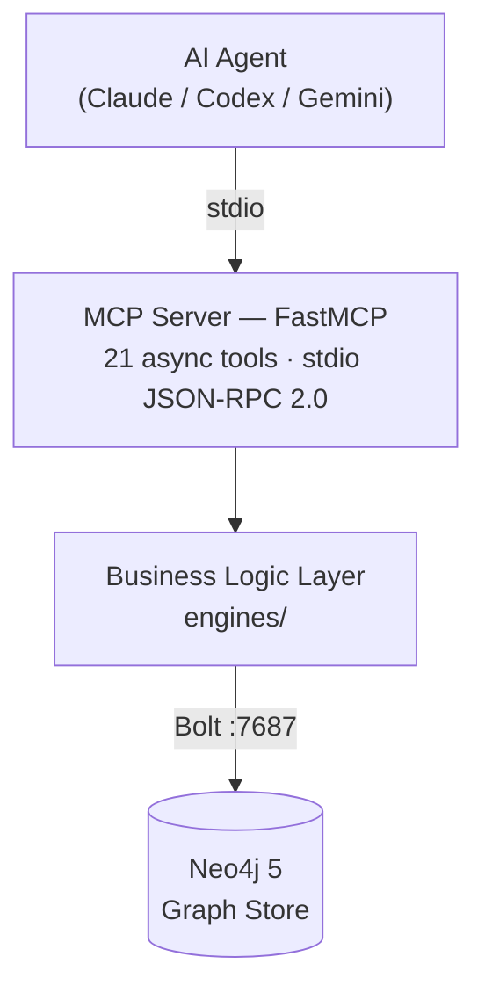

# Graphbase Memories MCP

**Graph-backed persistent memory for AI coding agents, exposed as an MCP server.**

Agents (Claude, Codex, Gemini, and others) call 21 structured tools to read and write scoped memory into a **Neo4j** graph database. Memory survives across sessions, accumulates decisions and patterns over time, and surfaces the most relevant context when you need it.

---

## Why graph memory?

Most agent memory is flat — a list of notes, a vector store of embeddings, or session summaries that drift away. `graphbase` organizes memory as a **property graph**:

- **Scopes** (`global` / `project` / `focus`) keep cross-project knowledge separate from initiative-specific context.
- **Artifact types** (sessions, decisions, patterns, context snippets, entity facts) give structure to what agents remember.
- **Graph edges** (`[:SUPERSEDES]`, `[:CONFLICTS_WITH]`, `[:PRODUCED]`) make the lineage and relationships between memories explicit and queryable.

---

## What agents can do

| Action | Tool |
|---|---|
| Load context before reasoning | `retrieve_context` |
| Fast BM25 keyword lookup for a specific topic | `memory_surface` |
| Save a session summary | `save_session` |
| Save session + decisions + patterns in one call | `store_session_with_learnings` |
| Save an architectural decision (with dedup) | `save_decision` |
| Save a repeatable workflow pattern | `save_pattern` |
| Save a free-form context snippet | `save_context` |
| Upsert a named entity and its relationships | `upsert_entity_with_deps` |
| Obtain a global-scope write token | `request_global_write_approval` |
| Route a task to the right reasoning mode | `route_analysis` *(deprecated — use `analysis_routing` prompt)* |
| Run memory hygiene (detect duplicates, stale items, freshness) | `run_hygiene` |
| Register or deregister a service in a workspace | `register_federated_service` |
| List services active in a workspace | `list_active_services` |
| Search memory across services | `search_cross_service` |
| Create a cross-service knowledge link | `link_cross_service` |
| Propagate a breaking change across services | `propagate_impact` |
| Get workspace health metrics and conflicts | `graph_health` |
| Register a service topology node | `register_service` |
| Link topology nodes (service, datasource, queue, feature) | `link_topology_nodes` |
| Batch upsert shared infrastructure nodes | `batch_upsert_shared_infrastructure` |
| Traverse service dependency graph | `get_service_dependencies` |
| Get ordered feature workflow | `get_feature_workflow` |

---

## Requirements

- Python 3.11+
- Neo4j 5 Community (or Enterprise) — local or remote
- An MCP-compatible agent host (Claude Code, Cursor, Cline, etc.)

---

## Quick links

- [Quick Start](quickstart.md) — up and running in 3 steps
- [MCP Tools Overview](tools/index.md) — all 21 tools with call sequence
- [Memory Model](concepts/memory-model.md) — scopes, artifacts, graph edges
- [Configuration](configuration.md) — all `GRAPHBASE_*` environment variables
