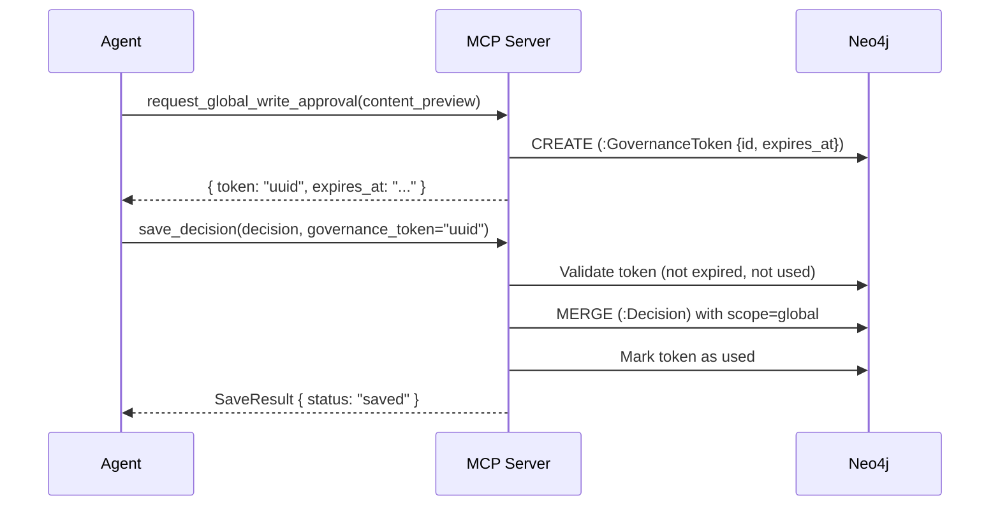

# Governance Tool

One tool for obtaining write permission for global-scope memory.

---

## Why global writes require approval

The `global` scope holds **cross-project reusable knowledge** — patterns, decisions, and context that will be surfaced to every project that uses this server. A mistaken global write could pollute memory for all agents. The governance gate requires an explicit approval token to prevent accidental global writes.



---

## `request_global_write_approval`

Obtain a one-time token required for any `scope="global"` write operation. The token is stored as a `GovernanceToken` node in Neo4j (durable across server restarts) and expires after `GRAPHBASE_GOVERNANCE_TOKEN_TTL_S` seconds (default: 60).

### Parameters

| Parameter | Type | Required | Description |
|---|---|---|---|
| `content_preview` | `string` | Yes | Brief description of the global write being requested |

### Returns

On approval:
```json
{
  "token": "3f2a1b4c-8e9d-...",
  "expires_at": "2026-04-08T10:01:00Z"
}
```

On block (e.g. server configured to deny all global writes):
```json
{
  "blocked": true,
  "reason": "Global write approval not permitted in this configuration"
}
```

---

## Using the token

Pass the token as `governance_token` to any artifact tool with `scope="global"`:

```python
# Step 1: get a token
approval = request_global_write_approval(
    content_preview="Save session-start pattern as global best practice"
)

# Step 2: use it within the TTL window
save_pattern(
    pattern={
        "trigger": "When starting any new coding session",
        "repeatable_steps": ["Call get_scope_state", "Call retrieve_context"],
        "scope": "global",
        "last_validated_at": "2026-04-08T10:00:00Z"
    },
    project_id="my-project",
    governance_token=approval["token"]
)
```

!!! warning "Single use, short TTL"
    Each token is valid for **one write only** and expires after 60 seconds by default.
    If you need to write multiple global artifacts, request a new token for each one.

---

## Token expiry and cleanup

Expired and used tokens are cleaned up by the hygiene engine. They are also validated on every
write attempt — an expired token returns:

```json
{
  "status": "failed",
  "message": "GovernanceToken expired or already used"
}
```
