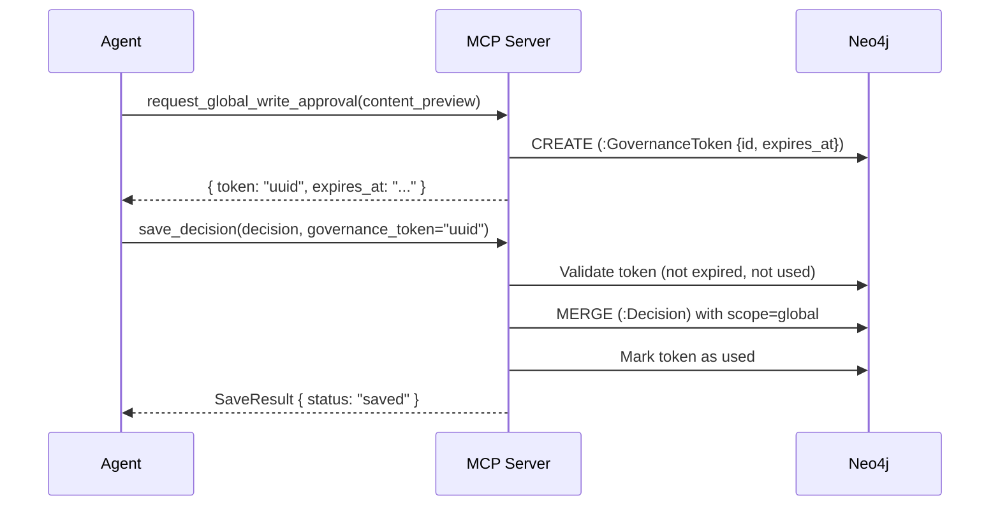

# Governance Tool

One tool for obtaining write permission for global-scope decisions.

---

## Why global writes require approval

The `global` scope holds cross-project reusable knowledge that can be surfaced to every project that uses this server. In the current tool surface, the governance gate is enforced for global-scope decisions, including decisions saved through `store_session_with_learnings`.



---

## `request_global_write_approval`

Obtain a one-time token required for global-scope decision writes. The token is stored as a `GovernanceToken` node in Neo4j (durable across server restarts) and expires after `GRAPHBASE_GOVERNANCE_TOKEN_TTL_S` seconds (default: 60).

### Parameters

| Parameter | Type | Required | Description |
|---|---|---|---|
| `content_preview` | `string` | Yes | Brief description of the global write being requested |

### Returns

On approval:
```json
{
  "token": "3f2a1b4c-8e9d-...",
  "expires_at": "2026-04-08T10:01:00Z",
  "ttl_seconds": 60,
  "instructions": "Pass this token as governance_token in save_decision(scope='global')."
}
```

If Neo4j is unavailable, the tool returns an `MCPError` with `code: "INTERNAL_ERROR"`.

---

## Using the token

Pass the token as `governance_token` to `save_decision` when `decision.scope="global"`, or to `store_session_with_learnings` when any batched decision is global-scoped:

```python
# Step 1: get a token
approval = request_global_write_approval(
    content_preview="Save global decision: load scoped graph memory before planning"
)

# Step 2: use it within the TTL window
save_decision(
    decision={
        "title": "Load scoped graph memory before planning",
        "rationale": "Shared context reduces repeated investigation across projects.",
        "owner": "platform",
        "date": "2026-04-21",
        "scope": "global",
        "confidence": 1.0
    },
    project_id="my-project",
    governance_token=approval["token"]
)
```

!!! warning "Single use, short TTL"
    Each token is valid for **one write only** and expires after 60 seconds by default.
    If you need to write multiple global decisions, request a new token for each one.

---

## Token expiry and cleanup

Expired and used tokens are cleaned up by the hygiene engine. They are also validated on every
write attempt — an expired token returns:

```json
{
  "status": "failed",
  "message": "GovernanceToken expired or already used"
}
```
